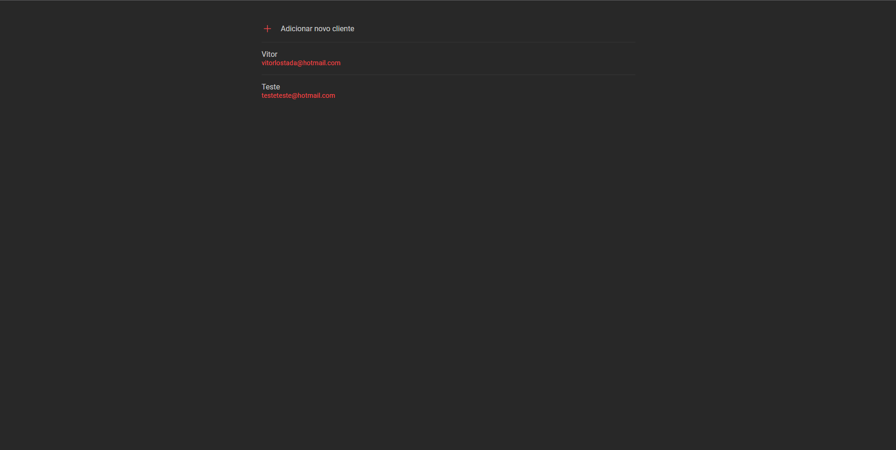

# React-JS--Crud-GraphQL-Mongodb




## About
Project made exclusively to be used in a youtube tutorial.

## Youtube

<div align="center" >
  <a href="https://www.youtube.com/watch?v=ArAaWgaXqXg">
    
  </a>
</div>

# How to run this project
If you want to run the project on your local machine, just follow the steps below:

## 💻 Starting the project
```bash

# Clone this repositorie


$ git clone https://github.com/vitorLostadaC/React-JS--users-table.git

# Intall dependencies on the backend and on the frontend


$ cd frontend:
$ yarn our npm intall

$ cd backend:
$ yarn our npm intall

# Run the frontend


$ yarn start our npm start:

$ Run server

$ yarn dev our npm run dev:

```

## Used Libraries

### backend

 + `apollo-server`
 + `dotenv`
 + `graphql`
 + `mongoose`
 + `type-graphql`
 
### frontend

 + `@apollo/client`
 + `graphql`
 + `cross-fetch`
 + `react-icon`
 + `styled-components`
 + `typescript`

 
# 📝 License
This project is under the MIT license.
